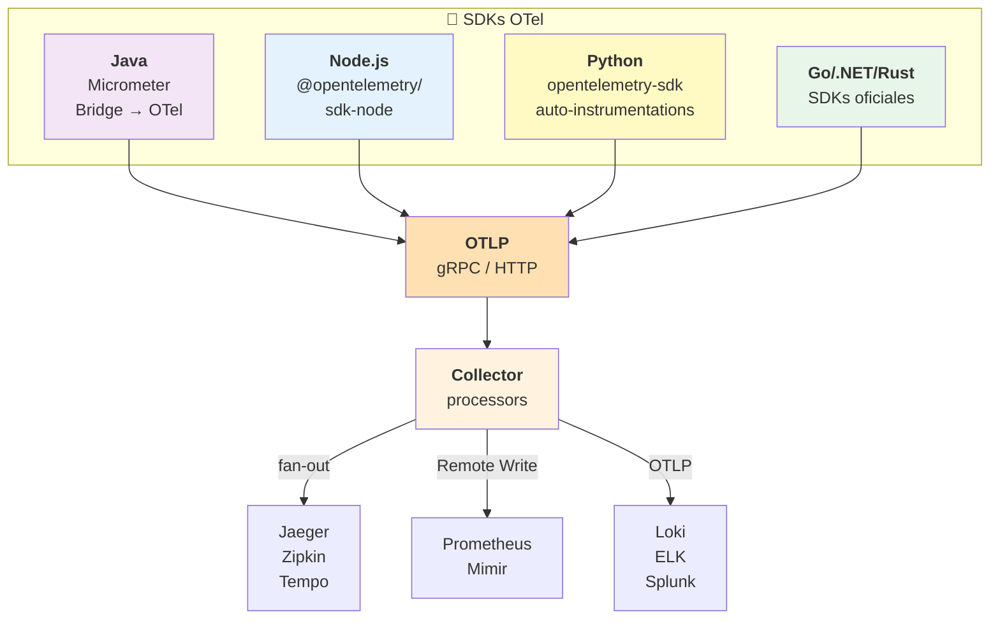
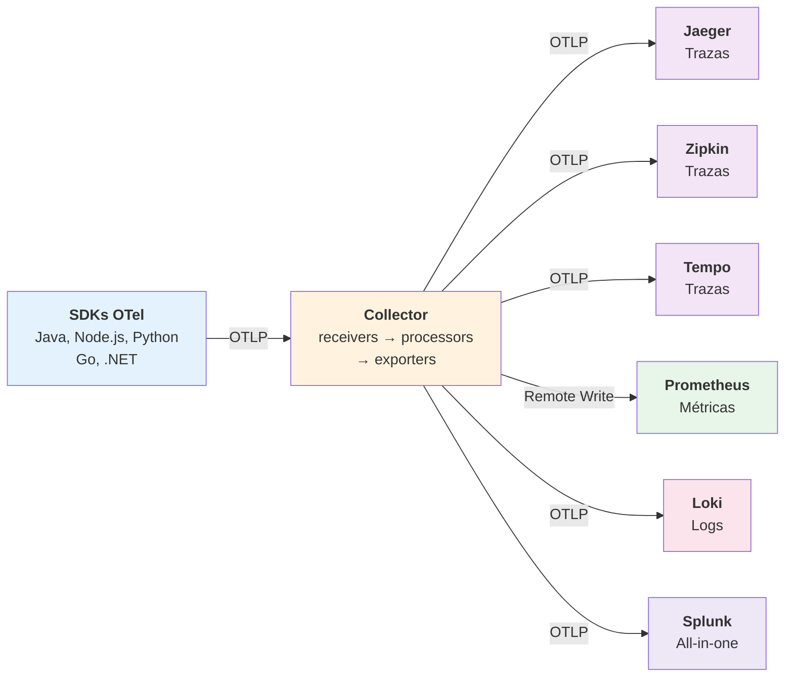
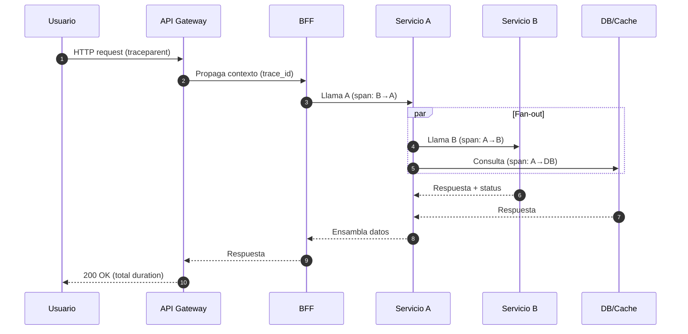
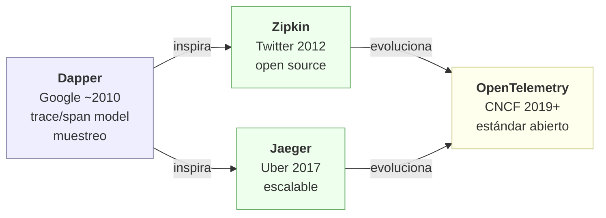
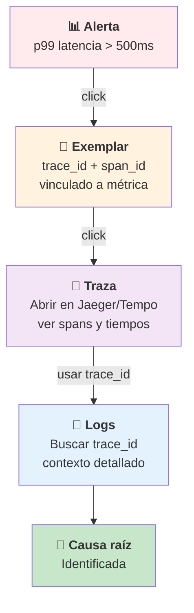
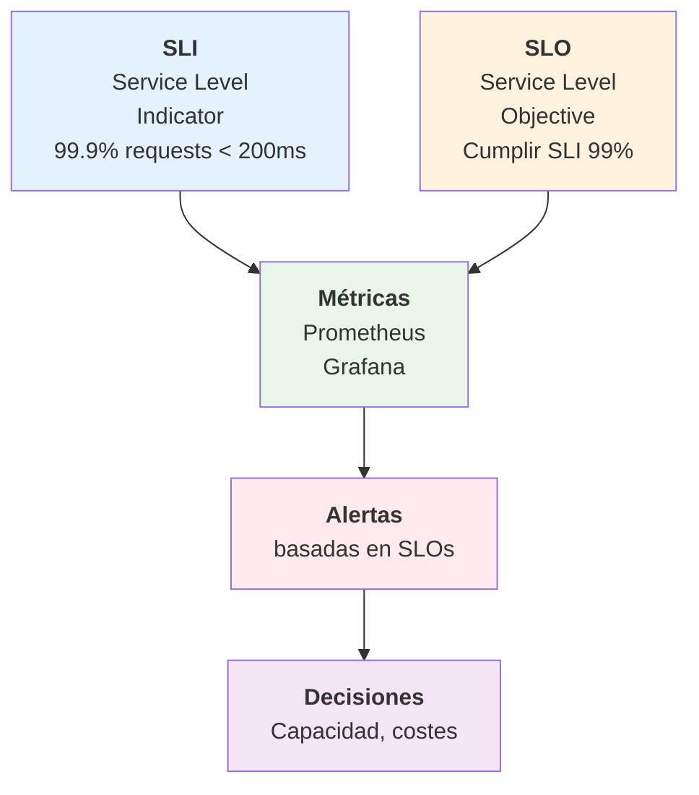

---
# try also 'default' to start simple
theme: the-unnamed
# fondo personalizado para la presentación
background: ./images/image-background.webp
# some information about your slides (markdown enabled)
title: Observabilidad y OpenTelemetry
info: |
  ## Guía del evento: Observabilidad y OpenTelemetry
  Presentación sobre observabilidad, OpenTelemetry, arquitectura distribuida y prueba práctica.
  
  Autores: Daniel García y Gabriel Andújar
  Fecha: 12 de noviembre de 2025
  
  Learn more at [OpenTelemetry](https://opentelemetry.io)
# apply UnoCSS classes to the current slide
class: text-center
# https://sli.dev/features/drawing
drawings:
  persist: false
# slide transition: https://sli.dev/guide/animations.html#slide-transitions
transition: slide-left
# enable MDC Syntax: https://sli.dev/features/mdc
mdc: true
# duration of the presentation
duration: 60min
---

## Observabilidad y OpenTelemetry

<div class="mt-12 py-1">
  Presiona espacio para continuar
</div>

<div class="abs-br m-6 text-xl">
  <button onclick="window.open('https://opentelemetry.io')" class="slidev-icon-btn" title="OpenTelemetry">
    🔗
  </button>
</div>

<!--
Índice rápido: mencionar timings (cada bloque ~5–10 min, demo 15 min). Mantener ritmo.
-->

---
transition: fade-out
---

# Índice

- Introducción a la Observabilidad
- OpenTelemetry: concepto y componentes
- Arquitectura y Collector
- Prueba práctica (Node.js, Python — Spring Boot deshabilitado)
- Cómo ejecutar la demo
- Recursos y cierre

<!--
Índice rápido: mencionar timings (cada bloque ~5–10 min, demo 15 min). Mantener ritmo.
-->

---
transition: slide-up
level: 2
---

# Introducción a la Observabilidad

## ¿Qué es la observabilidad?

- Entender el estado interno desde la telemetría.
- Señales: **métricas**, **logs**, **trazas**.
- Es una propiedad del sistema, no sólo una herramienta.

<!--
Explica con una frase: "Observabilidad = poder preguntar por qué algo pasa". Usar ejemplo simple (página lenta).
-->

---
transition: slide-left
---

# ¿Por qué importa?

- Reduce **MTTR** (Mean Time To Resolution).
- Permite pasar de "**qué**" a "**por qué**".
- Necesaria en arquitecturas **cloud-native** y **microservicios**.

<!--
Destaca un caso real: una petición atraviesa varios servicios; sin trazas no sabes cuál es culpable.
-->

---
transition: slide-right
---

# Monitoreo vs Observabilidad

<div grid="~ cols-2 gap-4">
<div>

## Monitoreo tradicional

- Checks y umbrales
- ¿Está **up/down**?
- Reactividad

</div>
<div>

## Observabilidad

- Correlación de señales
- ¿**Por qué** ocurre esto?
- Proactividad

</div>
</div>

<!--
Explicar con un ejemplo: alerta por p99 alto → traza para identificar el hop lento. Monitoreo detecta; observabilidad explica.
-->

---
transition: fade-out
---

# OpenTelemetry — visión rápida
<div grid="~ cols-2 gap-4">
<div class="mt-12">

## Framework abierto

- **APIs/SDKs** para instrumentación
- **Collector** para procesamiento
- **OTLP** como protocolo estándar
- Instrumentas una vez, eliges backend después
</div>
<div>


</div>
</div>
<!--
Mencionar neutralidad: cambiar Jaeger → SaaS sin tocar código (OTLP + Collector).
-->

---
transition: slide-up
---

# Señales: Traces / Metrics (1/2)

<div grid="~ cols-2 gap-4">
<div>

## Traces (Trazas)

- Reconstruyen recorrido **E2E**
- trace/span model
- Latencia por hop

</div>
<div>

## Metrics (Métricas)

- Agregados numéricos
- p99, QPS, rates
- Alertas y SLOs

</div>
</div>

<!--
Evitar definiciones largas; dar un ejemplo práctico rápido por señal.
-->

---
transition: slide-down
---

# Señales: Logs (2/2)

## Logging (Logs)

- Eventos textuales
- Análisis forense
- Correlación con trace_id

### Trabajan mejor juntas

- Alerta por métrica
- Abrir traza (exemplar)
- Revisar logs con trace_id

<!--
mostrar flujo: métrica alarma → abrir traza (exemplar) → revisar logs con trace_id.
-->

---
layout: two-cols
layoutClass: gap-16
transition: slide-left
---

# Collector y pipelines

## Arquitectura

- **Receivers**: reciben telemetría (OTLP, Zipkin, Jaeger, Prometheus)
- **Processors**: enriquecen, transforman, sampleen
- **Exporters**: reenvían a backends

::right::

## YAML mínimo

```yaml
receivers:
  otlp:
    protocols: 
      grpc: {}
      http: {}

processors:
  batch: {}

exporters:
  otlp:
    endpoint: jaeger:4317

service:
  pipelines:
    traces:
      receivers: [otlp]
      processors: [batch]
      exporters: [otlp]
```

<!--
Explicar por qué usar Collector: desacopla SDK ↔ backend, permite enrich/transform y fan-out.
-->

---
transition: slide-up
---

# Integración por lenguajes (resumen)



## Patrón común

SDK → **OTLP** (gRPC/HTTP) → **Collector** → **Backends**

---
transition: fade-out
---

## Resalte

- Java: Micrometer Tracing (bridge → OpenTelemetry) o agente.
- Node.js: Auto-instrumentations (precarga `-r tracing.js`).
- Python: FastAPI instrumentation (`app/telemetry.py`).
- Go/.NET: SDKs oficiales con patrón similar.

<!--
Resaltar patrón común: SDK → Collector (OTLP) → Backend. Mostrar una línea de comando para Node.js.
-->

---
transition: fade-out
---

# Backends típicos (resumen)



<div grid="~ cols-3 gap-4">
<div>

## Trazas
- Jaeger
- Zipkin
- Tempo

</div>
<div>

## Métricas
- Prometheus
- Remote Write
- Mimir

</div>
<div>

## Logs
- Loki
- ELK
- Splunk

</div>
</div>

<!--
Comentar que Collector hace fan-out a varios backends; usar ejemplos concretos durante Q&A.
-->

---
transition: slide-left
---

# Flujo en arquitectura distribuida


---
transition: slide-left
---

## Clave

- Propagación de **trace_id**
- Span por operación
- Identificar cuello de botella

<!--
Explicar propagación de contexto (traceparent). Indicar cómo identificar el span culpable (latencia/errores).
-->

---
transition: slide-up
---

# Prueba práctica — Componentes

<div grid="~ cols-2 gap-4">
<div>

## 🌦️ Spring Boot (Weather)
- Deshabilitado para la demo
- Micrometer Tracing
- OTel bridge

## 💰 Node.js (Cripto)
- Coinlore API
- `src/tracing.js`
- Mongo/OTLP

</div>
<div>

## 📰 Python (Noticias)
- FastAPI + DEV.to
- `app/telemetry.py`
- Mongo/OTLP

## 💻 Frontend React
- Consume APIs
- UI simple

</div>
</div>

<!--
Indicar que usaremos Node y Python para la demo; Spring está documentado pero desactivado.
-->

---
transition: slide-down
---

# Node.js (Cripto) — puntos clave

## Setup

```bash
npm install
node -r ./src/tracing.js src/server.js
```

## Paquetes

- `@opentelemetry/sdk-node`
- `@opentelemetry/auto-instrumentations-node`
- `@opentelemetry/exporter-otlp-http`

## Exportadores

- Custom Mongo
- OTLP hacia Collector

<!--
Mostrar `.env` breve y comando curl para generar tráfico. Explicar la colección de spans en Mongo.
-->

---
transition: slide-left
---

# Python (Noticias) — puntos clave

## Setup

```bash
python -m venv .venv
source .venv/bin/activate
pip install -r requirements.txt
uvicorn app.main:app --reload
```

## Alternativa con OpenTelemetry

```bash
opentelemetry-instrument \
  --exporter_otlp_endpoint http://localhost:4318 \
  uvicorn app.main:app --reload
```

## Exportadores

- Mongo (custom)
- OTLP

<!--
Durante demo, ejecutar /news y mostrar cómo aparecen spans en la colección. Resaltar métricas simples (counter).
-->

---
transition: fade-out
---

# Spring Boot (Weather) — nota corta

## Template disponible

- Spring Boot + Micrometer Tracing
- Bridge OpenTelemetry
- Métricas y trazas

## Estado en demo

- **No arrancó** por problemas de configuración
- Repo disponible para investigación posterior

<!--
Mencionar brevemente por qué no arrancó y dónde está el repo para quien quiera investigarlo.
-->

---
layout: two-cols
layoutClass: gap-16
transition: slide-up
---

# Cómo ejecutar la demo (rápido)

## Paso 1: Infraestructura

```bash
docker compose up
# Levanta Mongo, Collector, etc.
```

## Paso 2: Node.js

```bash
cd backend-nodejs
npm install
node -r ./src/tracing.js src/server.js
# http://localhost:3000
```

::right::

## Paso 3: Python

```bash
cd backend-python
python -m venv .venv
source .venv/bin/activate
pip install -r requirements.txt
uvicorn app.main:app --reload
# http://localhost:8000
```

## Paso 4: Variables de entorno

```bash
MONGODB_URI=mongodb://localhost:27017
OTEL_EXPORTER_OTLP_ENDPOINT=http://localhost:4318
```

<!--
Dar instrucciones concisas en el escenario: cuál terminal abrir y qué pedir a la audiencia (curl /health, /api/…).
-->

---
transition: slide-right
---

# Demo: qué observar

## Métricas

- p95 / p99 latencias
- Error rates
- QPS (queries per second)

## Trazas

- Span que provoca **fan-out**
- Dependencia **lenta**
- **Retries** y timeouts

## Logs

- Buscar **trace_id** para contexto
- Correlación forense

<!--
Durante la demo, enfocarse en un ejemplo: p99 alto → abrir traza → identificar span y ver logs.
-->

---
transition: fade-out
level: 2
---

# Recursos

<div grid="~ cols-2 gap-4">
<div>

## Documentación

- **OpenTelemetry**: https://opentelemetry.io/docs/
- **Getting Started**: https://opentelemetry.io/docs/getting-started/

</div>
<div>

## Repositorios

- **Node.js**: https://github.com/DGPOCs/opentelemetry-template-nodejs
- **Python**: https://github.com/DGPOCs/opentelemetry-template-python
- **Spring**: https://github.com/DGPOCs/opentelemetry-template-springboot

</div>
</div>

<!--
Decir que se enviarán enlaces/QR al final; aprovechar para recomendar lectura corta (OTel Getting Started).
-->

---
transition: slide-up
---

# Cierre y música

## Entrega

- 📱 Links/QR en el chat
- 📚 Documentación recomendada
- 💬 Preguntas en el canal

## Banda sonora

- 🎵 **Inicio**: "Ponle OTEL - Versión Country folk" (YouTube)
- 🎵 **Cierre**: "Ponte OTEL - Versión Rock" (YouTube)

<!--
Cerrar con call-to-action: probar los repos y preguntar en el canal. Mencionar comunidad OTel.
-->

---
layout: center
class: text-center
transition: fade-out
---

# Notas del presentador (resumen)

## Timing

- Cada bloque: **4–6 minutos**
- Demo práctica: **15 minutos**
- Q&A: **10 minutos**

## Flujo

1. **Contexto**: qué es observabilidad
2. **OTel**: componentes y patrones
3. **Demo**: vivo con Node + Python
4. **Recursos**: enlaces y comunidad

## Mensaje clave

> **Instrumenta una vez, cambia backend con Collector**

<!--
Tips: tener 2 terminales listos (Node + Python) y el panel de Mongo/Collector abierto. Si algo falla, tener curl y ejemplos preparados.
-->

---
layout: center
class: text-center
---

# ¡Gracias!

## Autores

**Daniel García** y **Gabriel Andújar**

Technitive - 12 de noviembre de 2025

---
# Diapositivas adicionales (opcional)

---
layout: image-left
image: https://images.unsplash.com/photo-1633356122544-f134324ef6db?w=600
transition: slide-up
---

# Dapper: Origen del tracing distribuido



## Impacto

- Primer sistema de tracing a escala
- Modelo: trace/span
- Muestreo para producción
- Inspiró Zipkin (Twitter, 2012) y Jaeger (Uber, 2017)
- Evolucionó hacia OpenTelemetry (CNCF, 2019+)

---
transition: slide-right
---

# Propagación de contexto (W3C)

## Cabeceras estándar

```
traceparent: 00-0af7651916cd43dd8448eb211c80319c-b7ad6b7169203331-01
tracestate: vendor-name=opaquevalue
```

## Componentes

- **Version**: formato (00)
- **Trace-ID**: identificador global (32 hex)
- **Parent-ID**: span padre (16 hex)
- **Flags**: tracing habilitado (01)

## Ventaja

- Vendor-neutral
- Cross-language / cross-service
- Asegura correlación E2E

---
transition: fade-out
---

# Exemplars: conectar métricas a trazas



## Backends

- **Prometheus** + **Tempo**
- **Grafana Loki**
- **Datadog / New Relic / Dynatrace**

## Beneficio

- Contexto inmediato
- Reducir MTTR

---
layout: two-cols
layoutClass: gap-16
---

# SLOs y SLIs con observabilidad



## SLI (Service Level Indicator)

- Métrica de disponibilidad real
- P.ej.: 99.9% requests < 200ms

## SLO (Service Level Objective)

- Objetivo de negocio
- P.ej.: cumplir SLI 99%

::right::

## Con observabilidad

- Métricas precisas desde logs/trazas
- Alertas basadas en SLOs
- Decisiones de capacidad y costes

## Herramientas

- **Prometheus** + alertas
- **Grafana** dashboards
- **Open Policy Agent** (OPA)
- **Cortex** (multi-tenant)

---

---

# Powered by Slidev

[Documentation](https://sli.dev) · [GitHub](https://github.com/slidevjs/slidev) · [Showcases](https://sli.dev/resources/showcases)
